# Using Bink 2 (Bink2ForUnreal) For Lagless Video Imports in Hades (FULL TUTORIAL)

Support and future updates courtesy of the [Hades Modding Discord](https://discordapp.com/invite/KuMbyrN). Discovery by me ! !!!! ! ! (And discord user red.)

*(If you already know how to prepare a file to be targeted by Bink, you can [skip ahead to the Bink Settings.](#bink-settings))*

`.bik` files are a kind of highly compressed video file commonly used in game development. Hades, for example, uses pre-rendered `.bik` files to animate its 3D. 

This guide will cover [downloading](#download-info) RAD Video Tools (Bink2ForUnreal), [creating](#video-creation) a video to replace a `.bik` in Hades, properly [adjusting](#bink-settings) Bink 2's settings to stop lag, and [modifying](#hex-editing) the `.bik` to work in Hades, since Hades only "supports" `.bik` videos in version 2.5, which recent updates do not generate. 

To import a `.bik` formatted video file into Hades without the lag that had previously stopped the community from replacing video files, you can use either the original RAD Video Tools (Bink 1; less options, will have issues with colors, but you can skip the hex editing step) or Bink2ForUnreal (Bink 2, maximum compatibilty and options, requires extra steps outside of RAD Video Tools, *recommended*). This guide will be using Bink 2, though we'll cover Bink 1 options when relevant.

<strong>Click For Links And Info On How to Download Bink 2 or 1 (free!)</strong>
<blockquote>

Bink 1 can easily be found for free on the <a href="http://www.radgametools.com/bnkdown.htm">RAD Video Tools site</a>, and Bink 2 is automatically included in downloads of <a href="https://docs.unrealengine.com/4.27/en-US/WorkingWithMedia/IntegratingMedia/BinkVideo/">Unreal Engine 5.0.</a> You should be able to find Bink2ForUnreal.exe in even a partial download of the engine. It can also be <a href="https://github.com/marcussacana/Bink2/raw/main/Bink2%20Encoder%20%2B%20DLLs%20FINALLY.rar">found elsewhere</a>, if need be.

<h3>Bink 2 from Unreal Engine</h3>
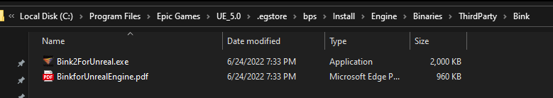

<h3>Bink 1 from RAD Video Tools</h3>

</blockquote>

 
<h2 id="video-creation">Video Creation</h2>
Create whatever video you want, and decide on what animation you want it to replace (new animations entirely are out of scope for this tutorial, though with <a href="https://github.com/SGG-Modding/SGG-Mod-Format/wiki/Import-Type:-SJSON">custom SJSON</a> it is very much possible). In this tutorial, we'll be setting the Club Penguin Penguin's dance to be Zag's idle animation.
  

By going into `Hades/Content/Movies/`, we can find the `.bik` file that we want—`ZagreusIdle_Bink.bik`. It has a corresponding `.bik_atlas` file. 

> (The `.bik_atlas` file contains a header and the bink file's name and resolution. If keeping resolution and filename the same (<u>*recommended*</u>), the `.bik_atlas` file can be safely ignored. If changing resolution, skip ahead to [the bik_atlas](#understanding-the-bik-atlas), but understand that this is literally undocumented territory, and may be really annoying to work with.)

Open `RAD Video Tools` or `Bink2ForUnreal.exe` and find your desired video! All screenshots in this tutorial will be using Bink 2, but the process is nearly identical in Bink 1.

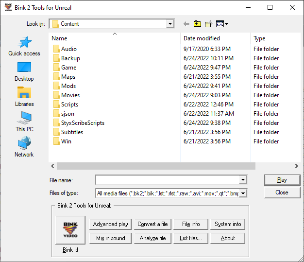

You'll want to navigate to your Hades folder in Bink 2 (this will likely work for other Supergiant Titles, but this guide was written for Hades) and find its Content subfolder. *(If you're having trouble locating that folder, <a href="https://www.nexusmods.com/hades/mods/26">the description of ModImporter</a> explains how to find it.)*

Once there, go to the Movies subfolder, and click on your chosen .bik. Then click File info. (You can also, for fun, play the file, or, for useful, convert it to an MP4, PNG sequence, or anything else.)

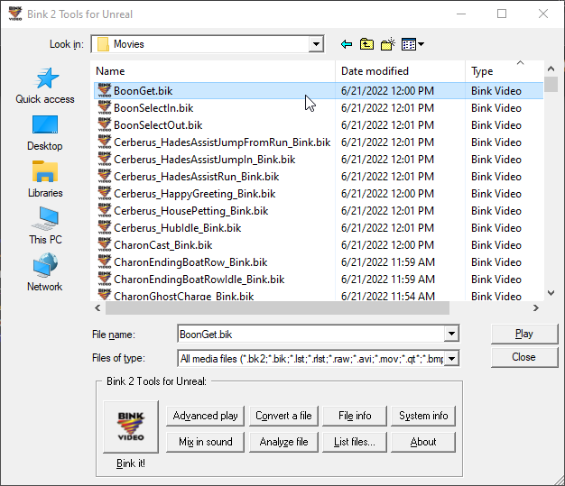

(In this example, we scroll down to find <code>ZagreusIdle_Bink.bik</code>.)

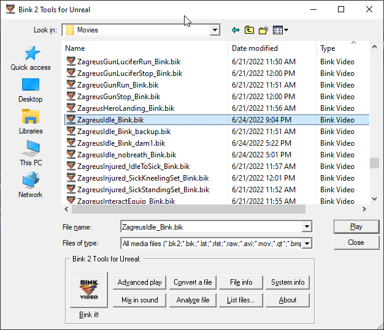

(Don't mind the extra copies of <code>ZagreusIdle_Bink.bik</code> - but this is actually a good opportunity to remind you about backing up any game files you modify!) Before taking any further steps, you should rename whatever file you're planning to modify to something like <code>nameoffile_BACKUP.bik</code>in the photo so that it won't be affected later in the process.

 
Clicking on <u>File Info</u> will make a screen like the below visible:
  

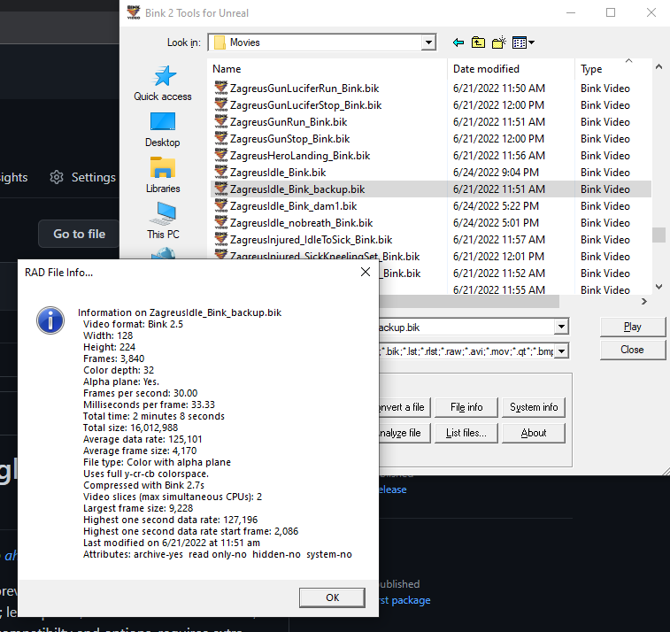

 
Take note of the width, height, and number of frames. Zagreus's idle animation is 128 pixels wide, 224 pixels tall, and has 3,840 frames of animation. (We will get to the frames of animation.)

Our chosen source gif has 104 unique frames, and is 100 pixels wide and 97 pixels tall, but we're targeting a resolution that does not match that. 

In our example, I'll open the gif in my editor of choice (<a href="https://www.photopea.com/">Photopea.com</a>), though of course you can edit your source file however you want. 
<h3>Video Preparation</h3>

> NOTE! This gif has some frames last longer than others, which means that importing the gif by itself will lead to only the unique frames being included in the `.bik` file!. Using ezgif, I redid the timings and cloned frames in order to have them export in sequence, one-per-frame, but using the gif as linked above will not work! I've attached a [zip file](docs/pengdance-to-crop.zip?raw) to this repo with the uncropped PNG sequence - just import them all into Photopea at once, put all the layers into one folder, and then the guide should be identical.

 
(Import your photo into <a href="https://www.photopea.com/">Photopea</a>.)

(It might be helpful to zoom in, especially for smaller images.)

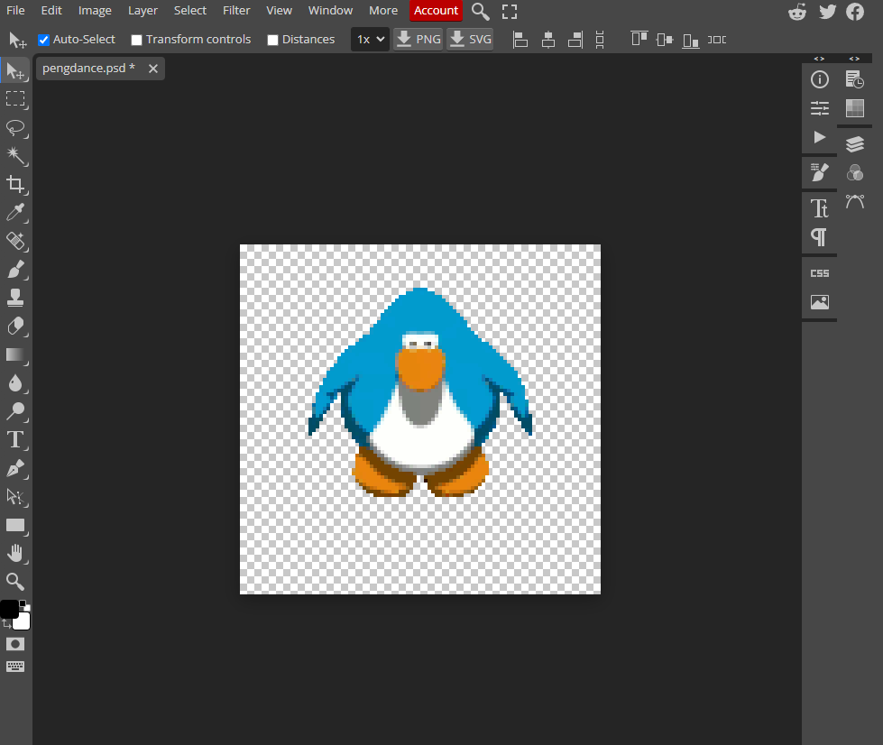

(Click <u>Image</u>...)

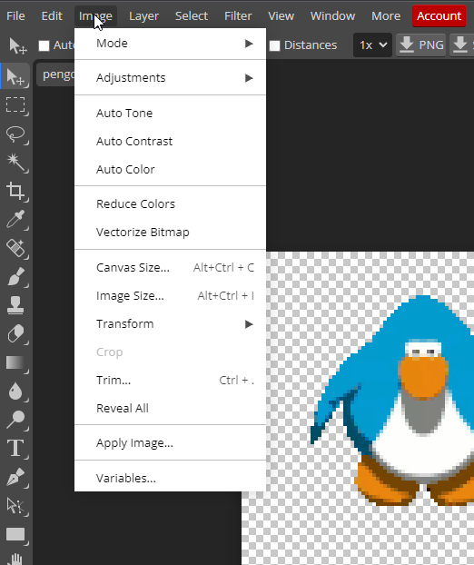

(...click <u>Canvas Size</u>...)

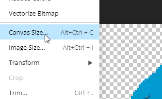

(...and type in the right width and height! In our case, that's 128 by 224 pixels.)

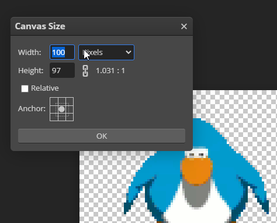

(Once you've got that, click <u>OK</u>.)

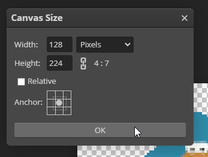

(Now the canvas is bigger, but we're too zoomed in!)

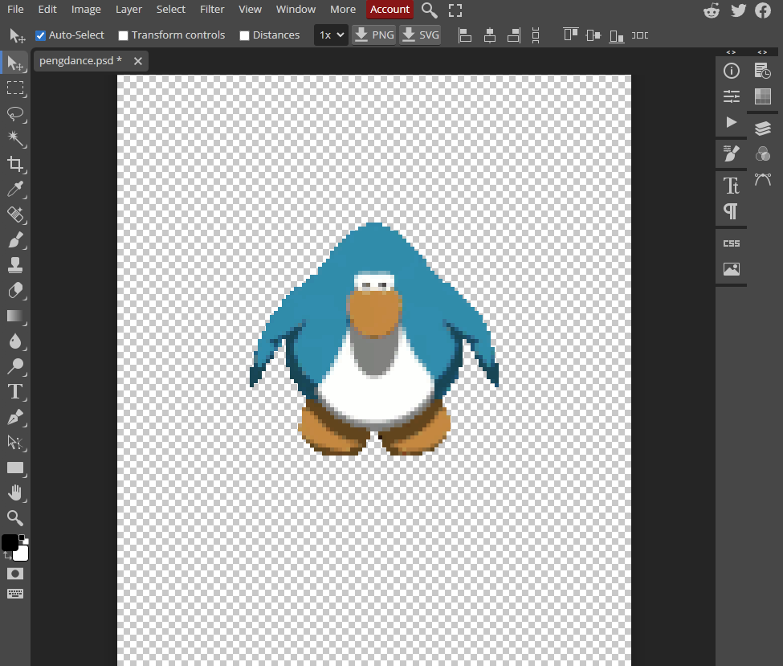

(Click <u>View</u>...)

(...and then click <u>Fit The Area</u>. This tells the image to take up exactly as much space as it can: no more and no less.)

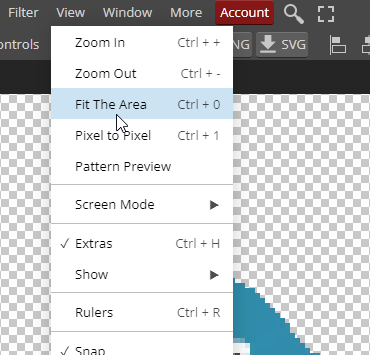

(With all that in mind, he's floating off the air!)

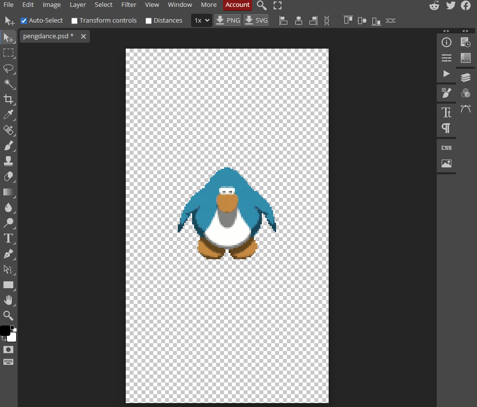

(Click on the *Layers* button (looks like a sandwich) to open up a new menu...)

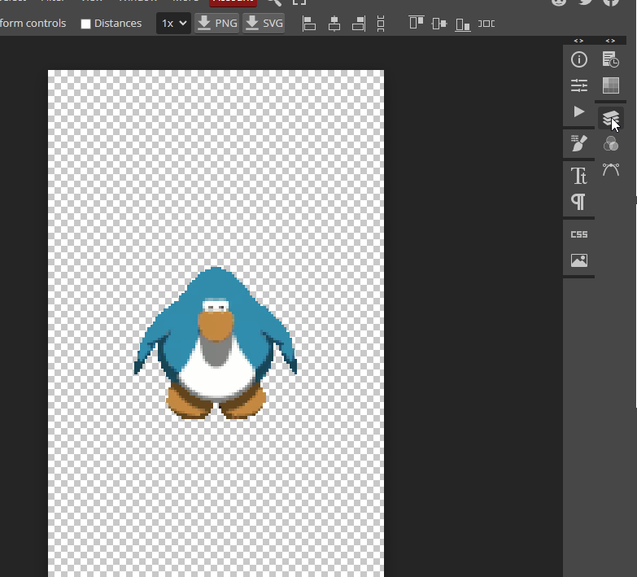

(...and then click on the folder, which has all of our images in it.)

(Then click to the <u>Move</u> tool, which is on the other side of the menu.)

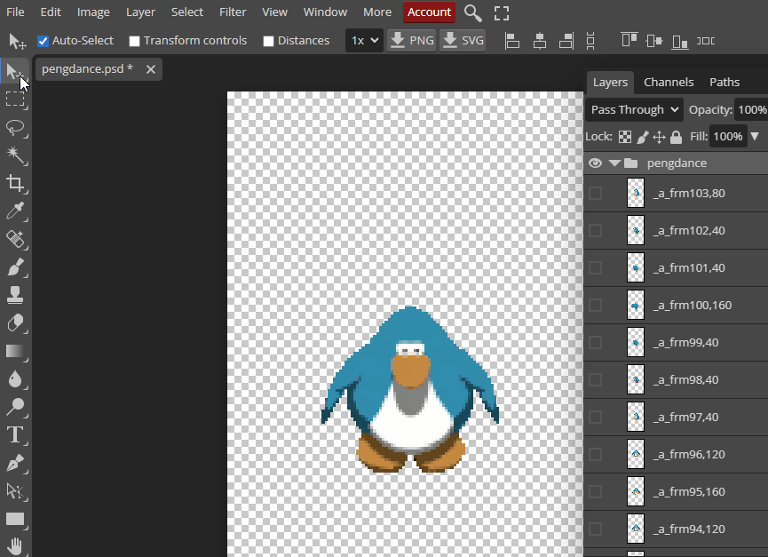

(You should now be able to click and drag to move all of the layers of the project at once! Move them around so that your character is positioned to be standing roughly where Zagreus was.)

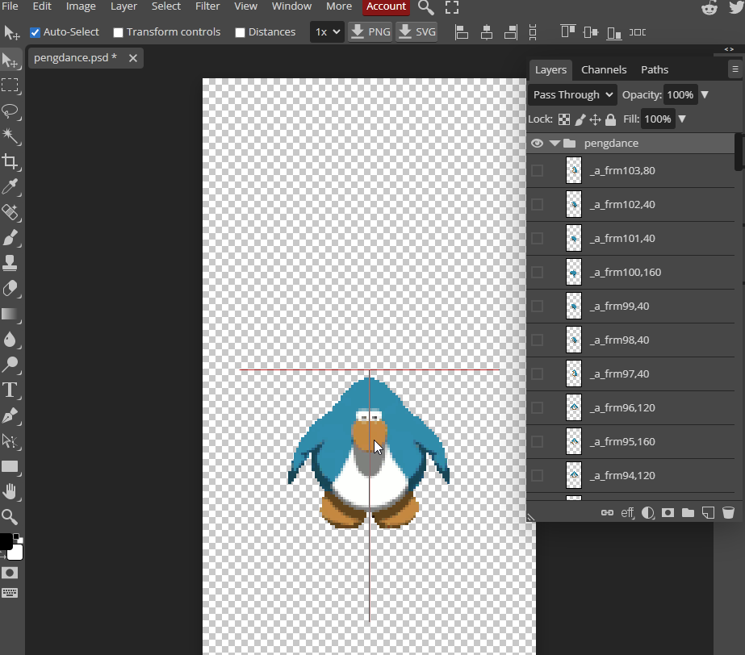

(Exporting is the last step. Go to <u>File</u>...)

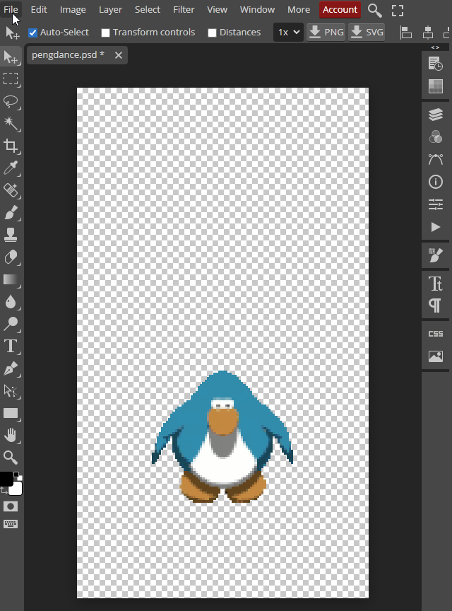

(...click <u>Export Layers</u>...)

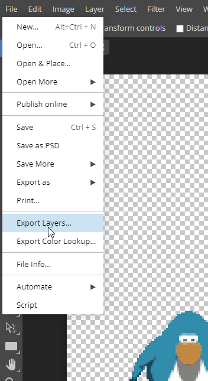

(...uncheck all the top boxes...)

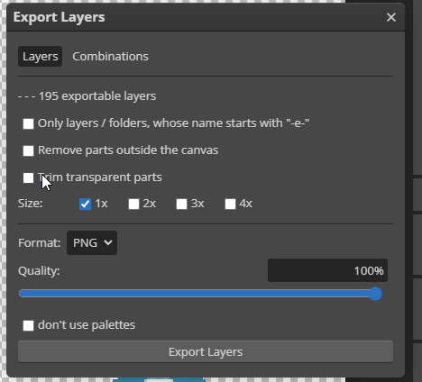

(...check the box that says <u>don't use palettes</u>, which helps stop transparency issues with Bink...)

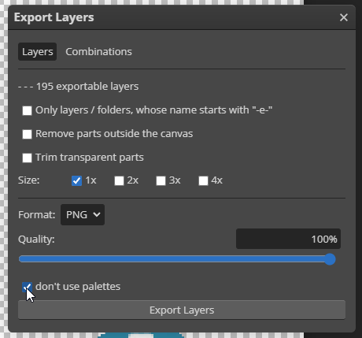

(...and once you extract the zip, you've become the proud owner of a PNG sequence of your design!)

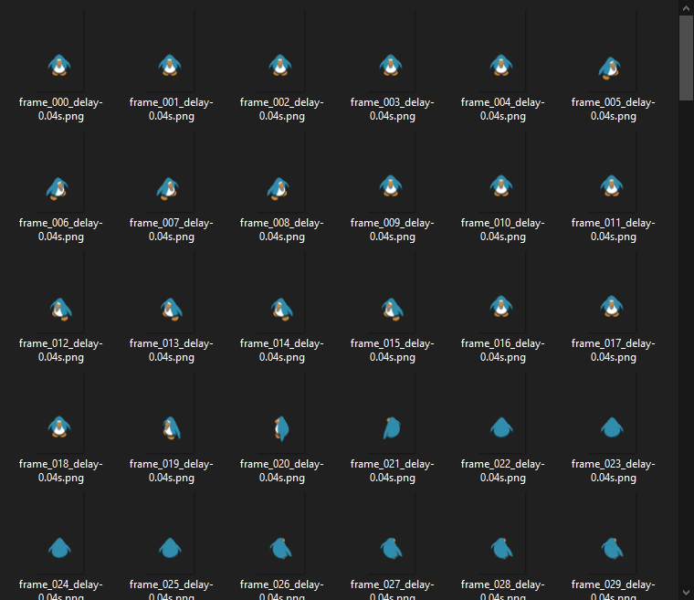

<h2>Now Back To Bink</h2>

Find wherever you extracted your PNG sequence to, and navigate there in Bink. You're going to want to click once on any of the frames, then click <u>List files...</u>.

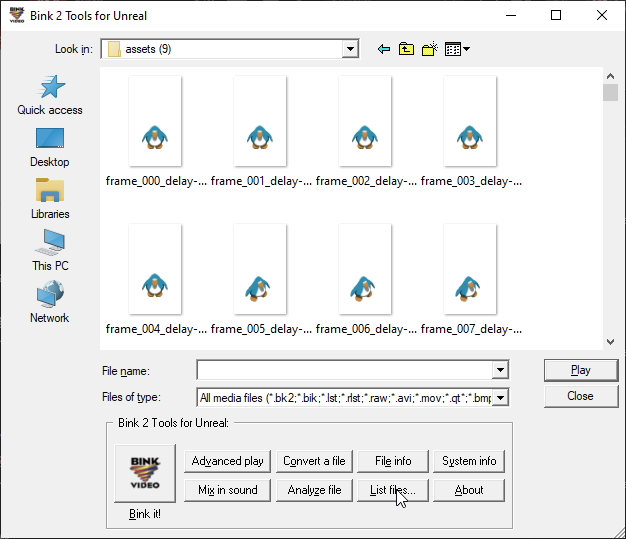

A dialog box should appear. Click yes if it asks you to treat the png sequence as a single animation, which is the whole point of the prior excersize.

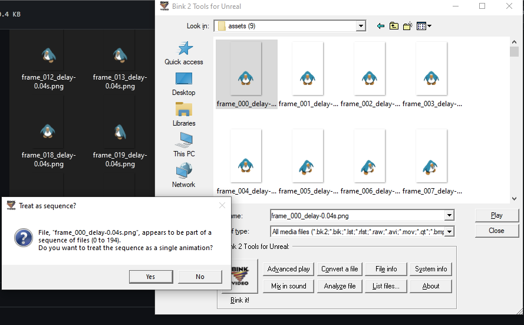

A dialog box should appear. Click yes if it asks you to treat the png sequence as a single animation, which is the whole point of the prior excersize.

Close it...

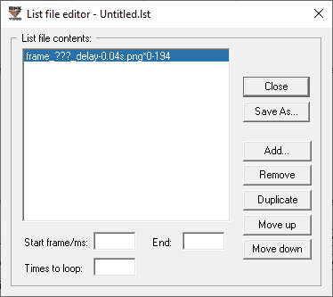

...save it...

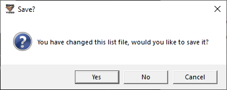

...name it...

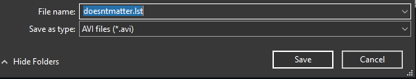

...and you've now got a `.lst` file ready to be Binked!!!

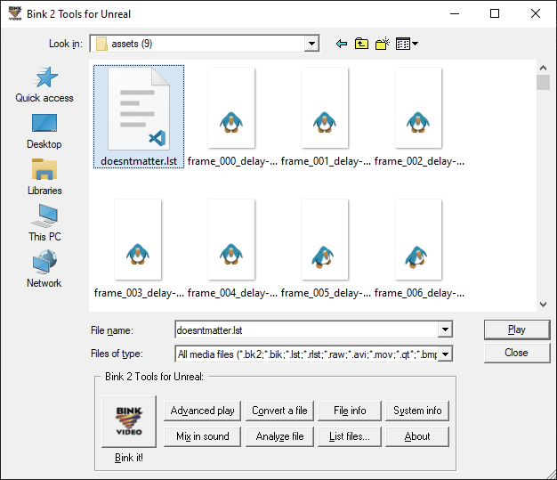

All that was to get us to this step. If you want to use this `.bik` in literally any other game, smash that <u>Bink it!</u> button and use that `.bik` to your heart's content.

For Hades modding, read on.

<h1 id="bink-settings">Bink Settings</h1>

Find your .lst, .mp4, .mov, or any other source file...

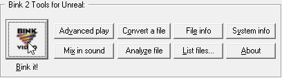

...and *Bink it.*

You'll be presented with a dizzying array of options.

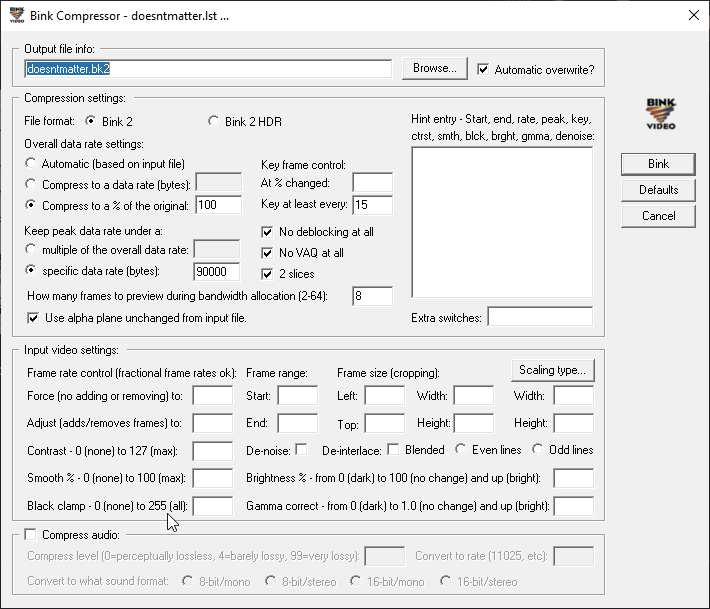

We only care about the output file name, and the compression settings. Change the output file name to whatever you want, so long as it ends with `.bik`. (Since this is going to replace `ZagreusIdle_Bink.bik`, I'll name it that, because I would need to change the name again later anyways).

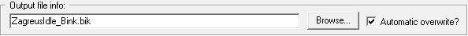

As for the compression settings, there are a lot of options! I don't know what all of them do. But I know what SOME of them do.

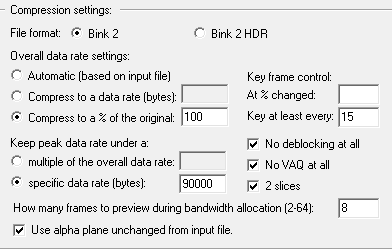

* File format: 
    * Unless you're working with HDR video (you probably aren't) stick with Bink 2.
* Overall data rate settings:
    * Probably more important than I think, but it's likely fine. I leave it at 100%.
* Peak data rate: 
    * This is where that "File info" button from earlier is useful. Target a number around the average and it should be fine.
* Frames to preview:
    * I literally have no idea what this does. Probably leave it.

You probably could've left all of those alone, honestly.

## SETTINGS YOU MUST CHANGE

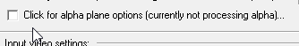

* Click for alpha plane options
    * You are more than likely using a transparent background. Click on this checkbox, and then click "leave alpha plane unchanged." That should work fine.
* Compress audio
    * You can uncheck this one, because there's no audio in your video, lol. It'll help with speeding the process up.
* Set video slices options
    * Hades uses two slices. This option is only be present in Bink 2 - it is not necessary, but it might help with issues.

In order to not have your `.bik` look washed out, also disable deblocking and VAQ. Doing so is exclusive to Bink 2.

**THIS IS THE MOST VITAL PART**

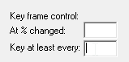

* Key frame control
    * Type in a number in the "Key at least every" box. For this animation, it's 15. 

You can find out what number you want by going out of the "Bink it!" window and clicking "Analyze file." 

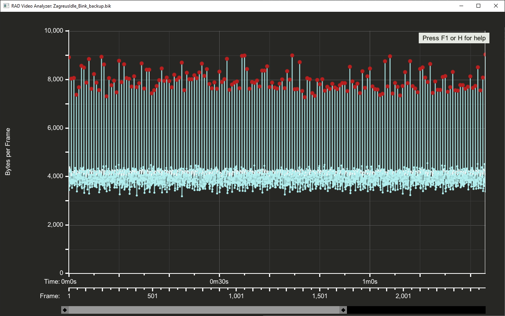

Use the mouse wheel to scroll in, and count how many frames exist between the evenly spaced red dots. In this case, there are 15 frames (as delinated by numbers on the bottom axis), so that is what we write in the keyframe settings.

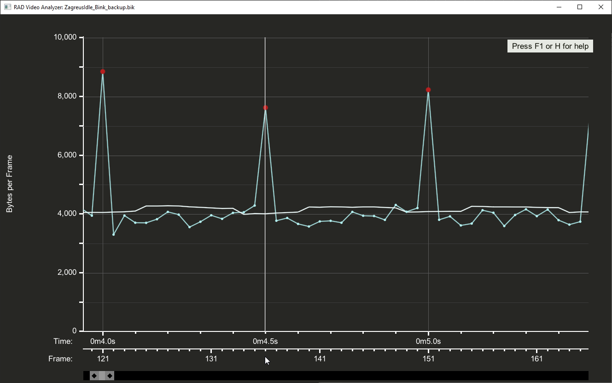

Double check that your file is being saved as a `.bik`... and smash that MF Bink button.

Congratulations! You now have a `.bik` file. 

If you're using Bink 1, you're done! Drop it into the Movies folder in your Hades game, use it in your Mod Importer mod, and enjoy the... washed out colors!!!!! But no lag, eh? 

Skip ahead to <a href="#sjson-tips">SJSON Tips</a> to properly configure your frame rate, if your source video has a different one than your original one.

If you're using Bink 2, read on.

<h1 id="hex-editing">Hex Editing</h1>

The problem with Bink 2 is that it's too good.

No, really. Bink 2, as provided by Unity, generates files in the "Bink 2.8" video format. Hades will only read files in the "Bink 2.5" video format.

All Bink 2.5 videos have a header in hex that looks like this:

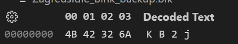

Whereas our Bink 2.8 videos all have a header in hex that looks like this:

Damn, right? Game over.

But what if you could...

Just reach out and...

...download <a href="https://code.visualstudio.com/">Visual Studio Code</a> and then install <a href="https://marketplace.visualstudio.com/items?itemName=ms-vscode.hexeditor">the offical hex editor extension</a> and then just.

Make that 6E in hex (the letter n in ascii)

Into 6A in hex (the letter j in ascii)

And save your file and have it match, and have Bink and Hades think your video is Bink 2.5?

...

Yeah, so you can literally just do that.

Yay!!!!!!!!!!

<h1>MOVING RIGHT ALONG</h1>

Wait, seriously? That was actually it?

Yeah.

Sheesh. Keyframes and version numbers.

That's the tl;dr right there. 

Here're gifs of the first working Zag replacements made with Bink 2:

You're gonna need to do some SJSON stuff to get it working right if you don't have the same number of angles and frames as the original gif, but it's 2:30 AM, and if you're familiar with SJSON edits, you can figure it out. The bink shenanigans are over..... for now.

I'll add sections about the `.bink_atlas` and recommended SJSON values to look at soon, but this should be enough to get you started!

<a href="https://classpectpokerap.tumblr.com/post/687812215438557185/megido-hades-mod">:D</a>
