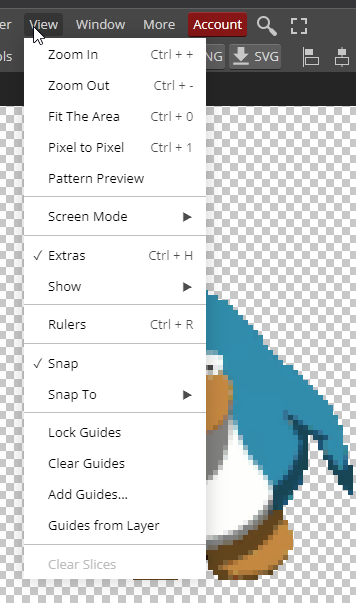
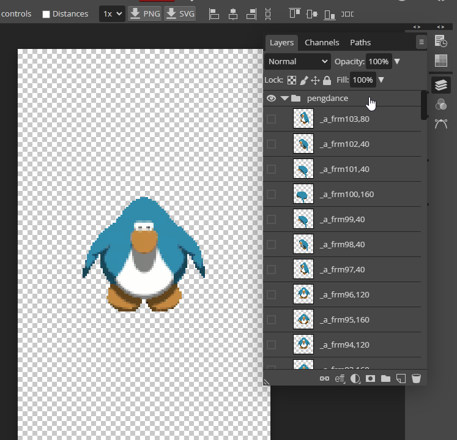

# Using Bink 2 (Bink2ForUnreal) For Lagless Video Imports in Hades (FULL TUTORIAL)

*(If you already know how to prepare a file to be targeted by Bink, you can [skip ahead to the Bink Settings.](#bink-settings))*

`.bik` files are a kind of highly compressed video file commonly used in game development. Hades, for example, uses pre-rendered `.bik` files to animate its 3D. 

This guide will cover [downloading](#download-info) RAD Video Tools (Bink2ForUnreal), [creating](#video-creation) a video to replace a `.bik` in Hades, properly [adjusting](#bink-settings) Bink 2's settings to stop lag, and [modifying](#hex-editing) the `.bik` to work in Hades, since Hades only "supports" `.bik` videos in version 2.5, which recent updates do not generate. 

To import a `.bik` formatted video file into Hades without the lag that had previously stopped the community from replacing video files, you can use either the original RAD Video Tools (Bink 1; less options, will have issues with colors, but you can skip the hex editing step) or Bink2ForUnreal (Bink 2, maximum compatibilty and options, requires extra steps outside of RAD Video Tools, *recommended*). This guide will be using Bink 2, though we'll cover Bink 1 options when relevant.

<strong>Click For Links And Info On How to Download Bink 2 or 1 (free!)</strong>
<blockquote>

Bink 1 can easily be found for free on the <a href="http://www.radgametools.com/bnkdown.htm">RAD Video Tools site</a>, and Bink 2 is automatically included in downloads of <a href="https://docs.unrealengine.com/4.27/en-US/WorkingWithMedia/IntegratingMedia/BinkVideo/">Unreal Engine 5.0.</a> You should be able to find Bink2ForUnreal.exe in even a partial download of the engine. It can also be <a href="https://github.com/marcussacana/Bink2/raw/main/Bink2%20Encoder%20%2B%20DLLs%20FINALLY.rar">found elsewhere</a>, if need be.

<h3>Bink 2 from Unreal Engine</h3>

<h3>Bink 1 from RAD Video Tools</h3>

</blockquote>

 
<h2 id="video-creation">Video Creation</h2>
Create whatever video you want, and decide on what animation you want it to replace (new animations entirely are out of scope for this tutorial, though with <a href="https://github.com/SGG-Modding/SGG-Mod-Format/wiki/Import-Type:-SJSON">custom SJSON</a> it is very much possible). In this tutorial, we'll be setting the Club Penguin Penguin's dance to be Zag's idle animation.
  

By going into `Hades/Content/Movies/`, we can find the `.bik` file that we want—`ZagreusIdle_Bink.bik`. It has a corresponding `.bik_atlas` file. 

> (The `.bik_atlas` file contains a header and the bink file's name and resolution. If keeping resolution and filename the same (<u>*recommended*</u>), the `.bik_atlas` file can be safely ignored. If changing resolution, skip ahead to [the bik_atlas](#understanding-the-bik-atlas), but understand that this is literally undocumented territory, and may be really annoying to work with.)

Open `RAD Video Tools` or `Bink2ForUnreal.exe` and find your desired video! All screenshots in this tutorial will be using Bink 2, but the process is nearly identical in Bink 1.

You'll want to navigate to your Hades folder in Bink 2 (this will likely work for other Supergiant Titles, but this guide was written for Hades) and find its Content subfolder. *(If you're having trouble locating that folder, <a href="https://www.nexusmods.com/hades/mods/26">the description of ModImporter</a> explains how to find it.)*

Once there, go to the Movies subfolder, and click on your chosen .bik. Then click File info. (You can also, for fun, play the file, or, for useful, convert it to an MP4, PNG sequence, or anything else.)

(In this example, we scroll down to find <code>ZagreusIdle_Bink.bik</code>.)

(Don't mind the extra copies of <code>ZagreusIdle_Bink.bik</code> - but this is actually a good opportunity to remind you about backing up any game files you modify!) Before taking any further steps, you should rename whatever file you're planning to modify to something like <code>nameoffile_BACKUP.bik</code>in the photo so that it won't be affected later in the process.

 
Clicking on <u>File Info</u> will make a screen like the below visible:
  

 
Take note of the width, height, and number of frames. Zagreus's idle animation is 128 pixels wide, 224 pixels tall, and has 3,840 frames of animation. (We will get to the frames of animation.)

Our chosen source gif has 104 unique frames, and is 100 pixels wide and 97 pixels tall, but we're targeting a resolution that does not match that. 

In our example, I'll open the gif in my editor of choice (<a href="https://www.photopea.com/">Photopea.com</a>), though of course you can edit your source file however you want. 
<h3>Video Preparation</h3>

> NOTE! This gif has some frames last longer than others, which means that importing the gif by itself will lead to only the unique frames being included in the `.bik` file!. Using ezgif, I redid the timings and cloned frames in order to have them export in sequence, one-per-frame, but using the gif as linked above will not work! I've attached a [zip file](docs/pengdance-to-crop.zip?raw) to this repo with the uncropped PNG sequence - just import them all into Photopea at once, put all the layers into one folder, and then the guide should be identical.

 
(Import your photo into <a href="https://www.photopea.com/">Photopea</a>.)

(It might be helpful to zoom in, especially for smaller images.)

(Click <u>Image</u>...)

(...click <u>Canvas Size</u>...)

(...and type in the right width and height! In our case, that's 128 by 224 pixels.)

(Once you've got that, click <u>OK</u>.)

(Now the canvas is bigger, but we're too zoomed in!)

(Click <u>View</u>...)

(...and then click <u>Fit The Area</u>. This tells the image to take up exactly as much space as it can: no more and no less.)

(With all that in mind, he's floating off the air!)

(Click on the *Layers* button (looks like a sandwich) to open up a new menu...)

(...and then click on the folder, which has all of our images in it.)

(Then click to the <u>Move</u> tool, which is on the other side of the menu.)

(You should now be able to click and drag to move all of the layers of the project at once! Move them around so that your character is positioned to be standing roughly where Zagreus was.)

(Exporting is the last step. Go to <u>File</u>...)

(...click <u>Export Layers</u>...)

(...uncheck all the top boxes...)

(...check the box that says <u>don't use palettes</u>, which helps stop transparency issues with Bink...)

(...and you're now the proud owner of a PNG sequence of your design!)

<h2>Now Back To Bink</h2>
